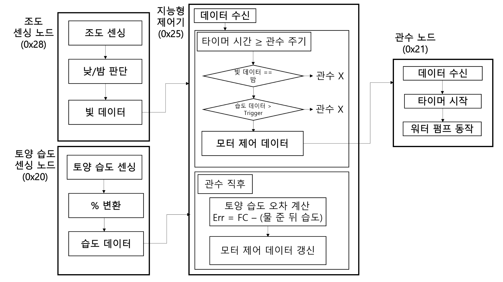
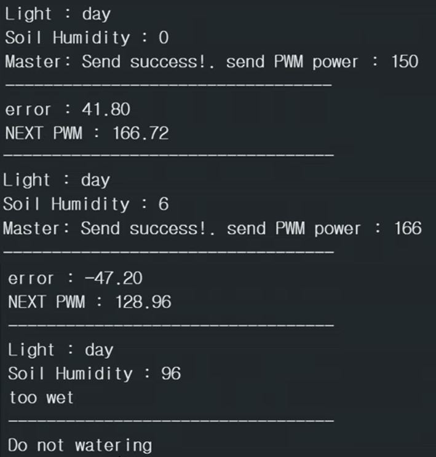
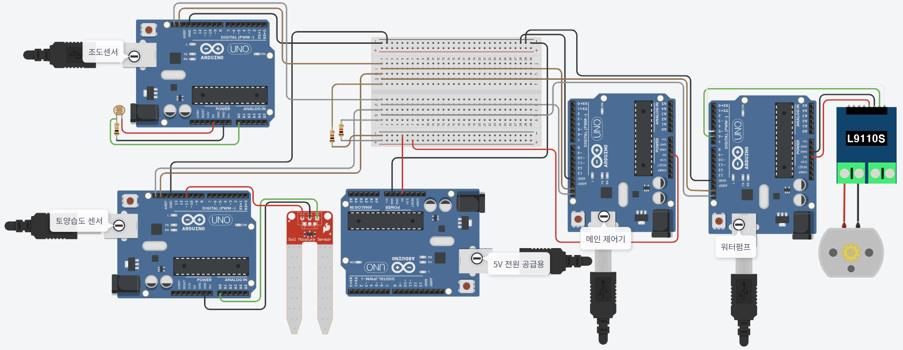

# 스마트 관개 시스템 — ATmega328P Multi-Master I2C

토양 수분과 조도를 실시간으로 감지해 필요한 시간에만 펌프를 자동 구동하는 스마트 관개 시스템.  
4개의 Arduino 노드가 Multi-Master I2C 버스를 공유하며, P-제어기가 토양 수분을 Field Capacity 기준으로 정밀 제어.  
**Arduino 표준 라이브러리(Wire, analogWrite 등)를 쓰지 않고 AVR 레지스터를 데이터시트 기준으로 직접 제어**해, I2C 통신, 타이머, PWM을 로우레벨부터 구현.


---

## 프로젝트 배경

기존의 단순 타이머 기반 관개 시스템은 **이미 충분히 습윤한 상태에서도 관수가 진행**되어 과습으로 작물이 손상되거나 물이 낭비된다. 야간에도 관수가 동작해 증발 손실도 크다.

이 프로젝트는 **토양 물리학 기반 수치(Field Capacity, RAW)와 P-제어기**를 결합해 작물이 수분 스트레스를 받기 직전에만 정밀하게 관수하도록 설계하였다. 4개 Arduino 노드가 Multi-Master I2C를 통해 협력하며, 야간 차단과 과습 차단 조건을 자동으로 적용한다.

---

## 시스템 구성

<p align="center">
  
</p>

```
[soil_sensor  0x20] ──┐
                       ├── I2C Bus (Multi-Master, 100kHz) ──→ [pump_actuator 0x21]
[light_sensor 0x28] ──┘        ↑
                         [controller 0x25]  ← 본인 구현
```

| 노드 | I2C 주소 | 역할 | 주요 HW |
|:------|:----------|:------|:---------|
| controller | 0x25 | P-제어, 관수 판단, PWM 생성 | ATmega328P |
| soil_sensor | 0x20 | 토양 습도 측정, 전송 | Grove Moisture Sensor, ADC |
| light_sensor | 0x28 | 주야 판별, 전송 | CdS(LDR), ADC |
| pump_actuator | 0x21 | 펌프 구동, 자동 종료 | L9110s H-bridge, Timer0 PWM |

---

## 본인 기여

팀 프로젝트에서 **제어 노드(controller, I2C 0x25) 펌웨어 전담** — P-제어기부터 비차단 TWI, 타이머 스케줄러까지 설계하고 구현.

시스템 자체는 복잡하지 않지만, **Arduino의 고수준 라이브러리에 의존하지 않고 ATmega328P의 하드웨어 레지스터를 직접 제어**해 통신부터 타이밍까지 로우레벨에서 구현. 그 결과 라이브러리가 감추던 TWI 상태 머신, 인터럽트, 타이머 프리스케일러의 동작을 데이터시트 수준에서 이해하고, 표준 `Wire`로는 다루기 어려운 **비차단(non-blocking) 동작과 슬레이브↔마스터 이중 모드**를 직접 설계함. 라이브러리의 블로킹 호출에 막히지 않고 센서 수신, 제어 연산, 펌프 제어를 하나의 루프에서 끊김 없이 돌릴 수 있게 되었음.

- **TWI(I2C)**: `TWCR`/`TWSR`/`TWDR`/`TWBR`/`TWAR` 직접 조작으로 슬레이브 수신 + 마스터 송신 이중 모드 구현
- **타이머**: Timer2 오버플로우 ISR로 비차단 소프트웨어 스케줄러, Timer0 Fast PWM으로 펌프 듀티 제어
- **결과**: 라이브러리 블랙박스 없이 인터럽트와 레지스터 타이밍을 직접 통제해, Multi-Master 버스 충돌 처리와 슬레이브↔마스터 모드 전환 타이밍까지 제어 가능한 펌웨어 완성

### P-제어기 설계

```c
err = FC - hum_data;           // 목표(Field Capacity) - 현재 토양 습도
float k = (err > 0.0f) ? K_DRY : K_WET;  // 비대칭 게인
pwm += k * err;
if (pwm < 0.0f)   pwm = 0.0f;
if (pwm > 254.0f) pwm = 254.0f;
```

- `FC = 47.8%` : 작물이 최대로 이용할 수 있는 토양 수분 상한값 (Field Capacity)
- `TRIGGER = 37.87%` : FC − RAW(9.93%). 이 아래로 떨어지면 관수 개시
- 비대칭 게인(`K_DRY=0.40`, `K_WET=0.80`): 과습에서는 빠르게 차단, 건조에서는 점진적 증수

### 이중 역할 TWI 운용 — 슬레이브 수신 + 마스터 송신

Arduino Wire 라이브러리를 사용하지 않고 TWCR/TWSR/TWDR/TWBR/TWAR 레지스터를 직접 제어해,  
평상시 슬레이브로 센서 데이터를 수신하다가 PWM 전송 주기마다 마스터로 전환해 펌프 노드에 명령을 보내는 이중 역할 구현.

### 비차단 슬레이브 수신 구조 (`twi_slave_listen`)

```c
// TWINT 플래그 폴링 — loop()에서 매 프레임 비차단 호출
case 0x60: expecting_sender_id = true;           // SLA+W: 송신자 ID 기다림
case 0x80: if (expecting_sender_id) sender_id = TWDR;  // 첫 바이트 = 송신자 주소
           else switch(sender_id) {
               case 0x20: hum_data   = TWDR;
               case 0x28: light_data = TWDR;
           }
case 0xA0: // STOP 수신 → 상태 초기화
```

ISR 대신 폴링 방식으로 구현해 Timer2 인터럽트와의 충돌 방지.

### 2단계 타이머 스케줄링

Timer2 Overflow ISR(prescaler 1024)로 tick을 누적해 비차단 소프트웨어 타이머 구현.

- **UPDATE_INTERVAL (5초)**: P-제어기 실행 → pwm 값 갱신
- **PWM_INTERVAL (15초)**: 차단 조건 확인 후 펌프에 PWM 명령 전송
  - `night_block`: 조도 센서가 야간 판정 → 관수 차단 (증발 손실 방지)
  - `soil_block`: 현재 습도 ≥ TRIGGER → 이미 충분히 습윤 → 관수 차단

**UART 시리얼 출력 — P-제어기 동작 확인:**

<p align="center">
  
</p>

---

## 기술적 문제 해결

### 1. Multi-Master I2C 버스 충돌 처리

각 노드가 독립적으로 마스터가 되어 전송을 시작하므로 버스 충돌(Arbitration Lost, TWSR=0x38) 발생 가능.  
→ TWSR 상태 코드를 모든 전송 단계에서 확인해 충돌 시 즉시 재시도 없이 다음 주기로 넘기도록 설계. 타이머 주기가 충분히 분산되어 충돌 빈도 최소화.

### 2. 마스터 전환 후 슬레이브 모드 복귀 타이밍

마스터 전송 완료 후 TWEN만 남기고 TWEA를 재설정해야 슬레이브 주소 응답 재개.  
→ `twi_master_transmit()` 완료 직후 `TWAR = (MY_ADDRESS << 1); TWCR = TWINT|TWEA|TWEN;` 순서로 복귀. 이 순서가 틀리면 다음 센서 전송을 놓침.

### 3. P-제어기 비선형 게인 튜닝

단순 고정 게인은 건조 시 펌프를 과도하게 동작시키거나 과습 복원이 느린 문제.  
→ 오차 부호에 따라 게인 분리(K_DRY=0.40 / K_WET=0.80). 과습에서는 빠른 차단, 건조에서는 점진적 증수로 안정성 확보.

### 4. 농학적 수치 적용

단순 임계값 대신 Field Capacity(47.8%), RAW(9.93%)를 적용해 TRIGGER 도출.  
"작물이 수분 스트레스를 받기 시작하는 직전"에만 관수하도록 설계해 과습과 과건조 모두 방지.

---

## 하드웨어 배선

<p align="center">
  
</p>

---

## 기술 스택

- **MCU**: ATmega328P (Arduino Uno) × 4
- **통신**: Multi-Master I2C 100kHz — AVR TWI 하드웨어 레지스터 직접 제어
- **타이머**: Timer2 overflow ISR (prescaler 1024) — 소프트웨어 스케줄러
- **PWM**: Timer0 Fast PWM on OC0A (PD6), ~976Hz
- **H-bridge**: L9110s — 방향 고정, PWM 듀티 조절로 펌프 속도 제어
- **센서**: Grove Moisture Sensor (토양), CdS 광저항 (조도)

---

## 주요 상수 정의

| 상수 | 값 | 의미 |
|:------|:----|:------|
| FC | 47.8% | Field Capacity (포장 용수량) |
| TRIGGER | 37.87% | 관수 개시 임계값 (FC − RAW) |
| K_DRY | 0.40 | 건조 상태 P-게인 |
| K_WET | 0.80 | 과습 상태 P-게인 |
| PWM_INTERVAL | 61 × 15 ticks | 펌프 명령 전송 주기 (~15초) |
| UPDATE_INTERVAL | 61 × 5 ticks | 제어기 갱신 주기 (~5초) |
| PUMP_OFF_COUNT | 183 ticks | 펌프 자동 종료 (~3초) |

---

## 소스 코드 구조

```
src/
├── controller/
│   └── controller.ino      ← 본인 구현 (P-제어기, TWI 이중모드, 스케줄러)
├── soil_sensor/
│   └── soil_sensor.ino     ← 토양 습도 측정 및 I2C 전송
├── light_sensor/
│   └── light_sensor.ino    ← 조도 기반 주야 판별 및 I2C 전송
└── pump_actuator/
    └── pump_actuator.ino   ← PWM 수신, L9110s 제어, 자동 종료
```
